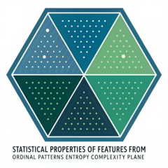

# StatOrdPattHxC
## Statistical Analysis of Features from Ordinal Patterns in the Entropy-Complexity plane

<!-- badges: start -->

<!-- badges: end -->

The goal of StatOrdPattHxC is to provide high-level functions for computing the following quantities:

* Under the multinomial model:
    * The asymptotic normal variance of several types of entropy (Shannon, Rényi, Tsallis) and of the Fisher information measure
    * The asymptotic normal mean and variance of the Statistical Complexity
 
* For Bandt & Pompe symbols:
    * The symbolisation operation that transforms a time series realisation into a sequence of symbols
    * The asymptotic normal mean and variance of the entropy of these symbols
    * A test that assesses if two time series realisations have the same entropy

## Installation

You can install the development version of StatOrdPattHxC in R with the following commands:

``` r
install.packages("devtools")
devtools::install_github("arey1911/StatOrdPattHxC")
```

Check the package vignette for examples.


