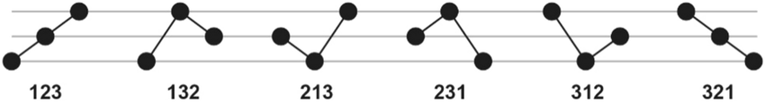

```{r setup, include=FALSE}
knitr::opts_chunk$set(echo = FALSE,
                      out.extra = "")  # This forces knitr to label all figures.
```

# Introduction {#sec1}

Bearings are critical components in rotating machinery, yet their demanding operating conditions, which involve high loads and impacts, often lead to various faults. These faults can cause significant downtime, costly maintenance, and even complete machine failure. Therefore, early and accurate detection and classification of bearing faults are essential to ensure operational reliability and minimize maintenance costs.

Traditional fault detection methods primarily rely on analyzing physical parameters and trends using techniques such as vibration analysis, thermal monitoring, and current signature analysis. While these methods have proven effective, they can be susceptible to noise and often require substantial computational resources. Ordinal pattern analysis has emerged as a promising alternative, offering a robust and computationally efficient approach to analyzing time series data.

At its core, ordinal pattern analysis transforms continuous time series data into a sequence of ordinal patterns that represent the order relationships among data points within a specified time window. This approach effectively captures the fundamental dynamics of the signal in a way that is inherently robust to noise and distortions. By analyzing these patterns, it becomes possible to identify subtle changes in system behavior that may indicate the presence of a fault.

This study investigates the application of ordinal pattern analysis for the early detection and classification of bearing faults, focusing on common fault types such as ball defects, outer race defects, and inner race defects. Using a publicly available dataset from the Case Western Reserve University Bearing Data Center, we demonstrate the effectiveness of ordinal patterns in distinguishing between healthy and faulty bearing conditions.

Our research explores the advantages of ordinal pattern analysis in detecting changes in system dynamics associated with faults. By identifying alterations in the frequency and recurrence of specific temporal patterns, this technique can reveal subtle indicators of developing faults. Furthermore, unlike some traditional methods limited to linear systems, ordinal pattern analysis can effectively detect faults in complex, non-linear systems, broadening its applicability.

While traditional methods often rely on specialized sensors and data acquisition systems, ordinal pattern analysis has the potential to achieve comparable results using simpler time series data, underscoring its potential for broader adoption. We investigate the sensitivity of ordinal pattern analysis to subtle changes in system dynamics, particularly in complex systems, where its strengths may be most pronounced.

Our goal is to establish ordinal pattern analysis as a viable and advantageous tool for bearing fault diagnosis, contributing to advancements in predictive maintenance technologies and promoting more efficient and reliable operation of rotating machinery.

# Literature Review {#sec2}

In the study conducted by @WOS:000312724900101, an enhanced approach is introduced to detect bearing faults using high-frequency resonance, which improves the precision and reliability of fault diagnosis in mechanical systems. The study demonstrates that this refined methodology effectively identifies early bearing abnormalities, marking a significant advancement over conventional diagnostic techniques. Additionally, @WOS:000301688000008 present a new technique for fault identification that uses an adaptive rank-order morphological filter to categorize patterns in one-dimensional signals. This approach increases the accuracy and robustness of fault diagnosis by effectively filtering and identifying signal irregularities. Furthermore, @WOS:000303039300034 proposes a method for early fault detection in machinery by analyzing truncated vibration signals through Shannon wavelet spectrum analysis. This technique enhances the detection of emerging faults, thereby improving the prognostic maintenance of equipment.

@WOS:000345844100102 discuss a prototype FPGA implementation that uses machine learning to convert analog signals into concise feature representations. This prototype employs an event-based methodology to enhance the efficiency and accuracy of signal processing across various applications. @WOS:000396580800080 explore the use of a dedicated hierarchy of neural networks for evaluating bearing degradation, thereby improving the precision and reliability of diagnosing the condition and remaining operational life of bearings in machinery. Additionally, @WOS:000320835800016 combine multifractal detrended fluctuation analysis with the Mahalanobis distance criterion to enhance the fault diagnosis of rolling bearings, leading to improved diagnostic accuracy and providing efficient, validated methods for early fault detection in industrial settings.

An additional intriguing research study detailed in the publication @WOS:000360994300029 introduces a diagnostic technique for rolling element bearings grounded in the concept of active perception. This method is based on the examination of the dynamic interactions between the bearing and its surrounding environment. Noteworthy discoveries include the capability of the approach to precisely evaluate the bearing's condition by integrating perceptual cues and responses, thereby enhancing fault detection and predictive maintenance strategies. @WOS:000343577703075 present a fault diagnosis approach for rolling element bearings that makes use of Empirical Mode Decomposition (EMD) in conjunction with Discrete Fourier Domain Analysis (DFDA). This technique effectively isolates and scrutinises fault-related characteristics in vibration signals, thereby enhancing the accuracy and dependability of bearing condition diagnosis. The utilisation of a signal-based triangular structuring element for mathematical morphological analysis, along with the application of this method to enhance fault diagnosis in rolling element bearings through the effective processing and interpretation of vibration signal features, was discussed in the publication [@WOS:000334316700001]. Moreover, a hybrid CEEMD-EMD approach for fault detection in rolling bearings, which combines Complete Ensemble Empirical Mode Decomposition with Noise (CEEMD) and traditional Empirical Mode Decomposition (EMD), has been developed in the manuscript by @WOS:000412752200052 to enhance the precision of vibration signal analysis and augment fault detection capabilities.

In their paper, @WOS:000335959500009 put forth a methodology for bearing fault detection that employs compressive measurements of vibration signals to efficiently detect faults, thereby enhancing diagnostic accuracy while reducing the data processing load. A distinctive technique for feature extraction, founded upon the crossover attributes of nonlinear data, is employed to facilitate enhanced fault diagnosis in rotary machinery through the effective identification of critical patterns in intricate signal data [@WOS:000338603900013]. The application of Self-Organising Maps (SOMs) has proven effective in diagnosing motor bearing faults through the classification of complex vibration data. Furthermore, approaches based on fast nonlocal means and envelope spectra have been shown to contribute to improving the accuracy of fault diagnosis.
Furthermore, a low-dimensional compressed measurement strategy enhances the efficiency of fault detection, while a Bayesian inference technique guided by a smoothness index enables the precise identification of various bearing faults through the analysis of anti-symmetric real Laplace wavelet parameters [@WOS:000380543400119; @WOS:000348309400067; @WOS:000354607100016; @WOS:000350998800016]. A novel machine fault diagnosis method utilising the Statistical Local Linear Embedding Algorithm (S-LLE) has been developed. This is an LLE extension that employs fault class labels to enhance feature extraction, dimensionality reduction and pattern recognition. This is achieved by mapping high-dimensional vibration signal vectors, which have been processed through the time domain, into a low-dimensional space.
The aforementioned techniques are then combined with frequency-domain and empirical mode decomposition (EMD) to create a low-dimensional space, which has been demonstrated to outperform PCA, LDA, and LLE for rapid fault classification. This is evidenced by the analysis of rolling bearing error signals, which have been shown to achieve superior error classification performance compared to conventional methods [@WOS:000361788200068]. The combination of wavelet packet decomposition with multi-scale permutation entropy has the potential to accurately detect bearing faults by utilising hidden Markov models [@WOS:000362513400031]. The results demonstrate that this approach significantly enhances the accuracy of fault detection in comparison to traditional methods, achieving greater precision in the identification of fault types and their severity. The integration of wavelet packet decomposition with multiscale permutation entropy serves to enhance the reliability of fault diagnosis systems, thereby rendering it a valuable technique for the purposes of predictive maintenance in industrial applications. 

@WOS:000365686400021 introduced a new feature extraction technique, Window Marginal Spectrum Clustering (WMSC), for diagnosing faults in roller element bearings (REBs). This method combines the Hilbert-Huang Transform (HHT) and Support Vector Machines (SVM) to enhance classification accuracy and robustness against Gaussian white noise. Experimental results using datasets from the Case Western Reserve University (CWRU) Bearing Data Center demonstrate that WMSC outperforms traditional methods.
@WOS:000366534900022 presented “The Diagnostic Line,” a novel criterion for monitoring the condition of rotating machinery, which aims to improve the accuracy and reliability of machinery health diagnoses. A comparative analysis using CWRU data was conducted to evaluate various diagnostic techniques and establish a standard reference for bearing fault diagnosis [@WOS:000357230900007].
@WOS:000385104500001 proposed an improved Wavelet Total Variation Denoising (W-TVD) technique for mechanical fault diagnosis, effectively filtering noise and enhancing fault detection accuracy. Findings show that this approach significantly outperforms traditional denoising methods.
Research on fault diagnosis in industrial rotating equipment, utilizing permutation entropy, signal processing techniques, and a multi-output neuro-fuzzy classifier, demonstrates effective identification of fault types and severity levels. Results indicate that combining permutation entropy for feature extraction with signal processing clarifies and distinguishes fault signatures, while the neuro-fuzzy classifier achieves high accuracy in multi-class fault identification. This integrated approach enhances diagnostic reliability and performance, offering a robust solution for real-time fault detection in industrial machinery [@Rajabi2022].
@WOS:000392016300001 elaborated on an adapted kernel marginal Fisher analysis (MKMFA) technique for feature extraction and dimensionality reduction to improve bearing fault diagnosis accuracy. By extracting critical low-dimensional features and using a K-nearest neighbor classifier, this approach demonstrates superior performance compared to alternative methods in identifying diverse bearing faults.

Signal analysis of vibrations is an effective approach for diagnosing mechanical faults. However, identifying defects in their early stages is challenging due to noise from other components [@WOS:000369301600001; @WOS:000367992900001]. These studies introduce a new methodology that combines time-domain analysis with adaptive fuzzy C-means clustering.

@WOS:000366765500038 presents an innovative technique for assessing machinery damage using manifold learning principles to compute subspace distances. @WOS:000379556300014 explores the use of Multivariate Empirical Mode Decomposition (MEMD) in diagnosing faults in rolling bearings, demonstrating its effectiveness in enhancing fault detection by thoroughly analyzing complex, multidimensional signal data.

@WOS:000391229300006 proposes a methodology for diagnosing faults in rolling element bearings by integrating Multifractal Theory with Gray Relation Theory, designed to improve the accuracy and reliability of fault detection and analysis, ultimately enhancing diagnostic outcomes. @WOS:000426819400027 investigates a new approach for analyzing vibration signals in rolling bearings, which combines dual-entropy, Holder coefficient, and Gray Relation Theory. This integration aims to boost the precision and reliability of diagnostics, achieving higher levels of fault detection efficiency.

@WOS:000398818700108 discusses the Shock Pulse Index (SPI) and its application in diagnosing faults in rolling element bearings, highlighting SPI’s effectiveness in detecting and analyzing bearing condition and performance issues. Results demonstrate that SPI provides accurate fault detection and is a valuable tool for monitoring and diagnosing bearing health.

@WOS:000404415000016 examines fault diagnosis for rolling bearings under variable conditions using visual cognition techniques. Findings indicate that visual cognition methods significantly enhance the ability to identify and assess bearing faults in changing operational environments.

@WOS:000401109400020 introduces sparse discriminant manifold projections for bearing fault diagnosis, utilizing advanced dimensionality reduction techniques to improve fault detection and classification accuracy. Results show that this method effectively identifies bearing faults by capturing essential discriminative features while minimizing noise and irrelevant data.

@WOS:000419006900041 presents a fault detection method for analyzing rolling bearings’ vibration signals using the Symplectic Entropy method. This method assesses the complexity and patterns in vibration data, enhancing fault identification accuracy. Findings confirm that this approach effectively detects faults by providing a robust measure of signal irregularities and anomalies.

@WOS:000416794600016 propose a method for extracting incipient fault features in rolling bearings using an autocorrelation function impulse harmonic-to-noise ratio index, combined with Singular Value Decomposition (SVD) and the Teager Energy Operator. Results indicate that this approach effectively identifies early-stage faults by amplifying subtle signal anomalies amidst noise.

@WOS:000484465800028 present a bearing fault diagnosis method combining autoencoders with Particle Swarm Optimization (PSO) and Support Vector Machines (SVM). This approach leverages autoencoders for feature extraction and dimensionality reduction, while PSO optimizes SVM parameters, resulting in improved diagnostic accuracy and robustness for bearing fault identification.

@WOS:000477760600037 introduce an optimized resolution coefficient algorithm for the Gray Relation Classifier to enhance classification accuracy. This algorithm refines the resolution coefficients, improving the classifier's ability to distinguish between classes, leading to more precise fault diagnosis and analysis.

@WOS:000477760600061 proposes a subtle feature extraction algorithm using an improved fractal box-counting dimension method. This method enhances the detection of fine-grained signal features by refining fractal dimension calculations, resulting in better identification and analysis of subtle signal patterns.

A novel rolling bearing fault detection method based on the Empirical Wavelet Transform (EWT) effectively decomposes vibration signals into components that highlight fault-related features, thereby enhancing detection accuracy and robustness in identifying bearing faults [@WOS:000467079500501].

@WOS:000459864800144 introduce a bearing fault detection method that combines Empirical Mode Decomposition (EMD) with Random Forest. This approach analyzes vibration signals under varying operational conditions by decomposing them into intrinsic mode functions and classifying fault patterns, leading to improved detection accuracy and reliability.

@WOS:000458657500187 critically examine the importance of feature extraction and selection in diagnosing bearing defects, emphasizing that effective feature extraction and selection are essential for improving diagnostic accuracy and reliability by identifying the most relevant characteristics in vibration signals.

An online health status estimation technique for rolling bearings based on vibration signals focuses on real-time monitoring and analysis to evaluate bearing condition. Research shows that this method effectively assesses health status through continuous vibration data analysis to identify and predict potential faults [@WOS:000452922000015].

@WOS:000453413600001 present an automatic classification approach for bearing faults using deep learning methods. This approach employs neural networks to analyze and categorize fault patterns in vibration signals, leading to enhanced accuracy and efficiency in fault detection and diagnosis.

@WOS:000452819600235 introduce a method for early fault diagnosis in bearings using the Empirical Wavelet Transform (EWT) combined with energy entropy. By analyzing vibration signals with detailed frequency decomposition and measuring the distribution of signal energy, this method improves the accuracy of early fault identification.

Another study by @WOS:000450745100001, along with @WOS:000449334500118, introduces a technique for detecting faults in rolling element bearings that involves segmenting vibration signals and applying wavelet analysis with deep neural networks. This method improves fault detection by segmenting signals into meaningful parts for enhanced accuracy, using wavelet transforms for feature extraction, and employing deep neural networks for clustering and categorization, resulting in more precise identification of bearing faults.

The study by @WOS:000440977000032 introduces a technique for extracting bearing fault features using autoregressive coefficients, Linear Discriminant Analysis (LDA), and Support Vector Machines (SVM) under varying operational conditions. This combination of methods enhances fault detection by accurately identifying and categorizing fault features, even in changing operational settings.

@WOS:000434717400001 propose a unique diagnostic approach for rolling element bearings, integrating Noise-Assisted Multivariate Empirical Mode Decomposition (MEMD) with a Functional Neural Fuzzy Network. This approach uses MEMD for effective feature extraction and the neural fuzzy network for precise fault classification, resulting in improved diagnostic precision and reliability.

@WOS:000426284100001 present a fault diagnosis method for rolling bearings that employs Modified Local Fisher Discriminant Analysis (LFDA) and Empirical Mode Decomposition (EMD) along with sensitive feature selection. The goal is to enhance fault detection by accurately extracting and analyzing critical features from vibration signals.

@WOS:000539546400083 detail an initial fault diagnosis technique for rolling bearings that combines Empirical Wavelet Transform (EWT) with Spectral Kurtosis. This method focuses on detecting initial faults through refined frequency analysis with EWT and highlighting abnormal signal features using Spectral Kurtosis, leading to improved early fault detection and diagnostic accuracy.

@hakim2023systematic introduce an enhanced similarity-based modeling approach for classifying failures in rotating machines. By applying advanced similarity measures to better match failure patterns, this method significantly improves diagnostic precision. Results indicate that it outperforms traditional classification techniques, achieving higher accuracy and reliability in failure detection. Additionally, a comprehensive review is provided on fault diagnosis methods for rolling bearings that utilize deep learning and transfer learning techniques.

@WOS:000345844100102 discuss a prototype FPGA implementation that uses machine learning to convert analog signals into concise feature representations. This implementation employs an event-based methodology to enhance the efficiency and accuracy of signal processing across various applications.

@WOS:000396580800080 explore a hierarchical neural network model to assess bearing degradation, aiming to improve the accuracy and reliability of diagnosing machinery bearing conditions and estimating remaining operational life.

@WOS:000320835800016 enhance rolling bearing fault diagnosis by combining multifractal detrended fluctuation analysis with the Mahalanobis distance criterion. This approach leads to improved diagnostic accuracy and provides efficient, validated methods for early fault detection in industrial settings. 

An additional intriguing study by @WOS:000360994300029 introduces a diagnostic technique for rolling element bearings based on the concept of active perception. This method examines the dynamic interactions between the bearing and its surroundings. Key findings include the approach’s ability to accurately assess bearing condition by integrating perceptual cues and responses, thereby enhancing fault detection and predictive maintenance strategies.

@WOS:000343577703075 present a fault diagnosis approach for rolling element bearings that combines Empirical Mode Decomposition (EMD) with Discrete Fourier Domain Analysis (DFDA). This technique effectively isolates and examines fault-related characteristics in vibration signals, resulting in improved accuracy and reliability in diagnosing bearing conditions.

@WOS:000334316700001 discuss the use of a signal-based triangular structuring element for mathematical morphological analysis to enhance fault diagnosis in rolling element bearings. This approach enables effective processing and interpretation of vibration signal features.

Furthermore, @WOS:000412752200052 propose a hybrid CEEMD-EMD strategy for fault detection in rolling bearings, merging Complete Ensemble Empirical Mode Decomposition with Noise (CEEMD) and traditional Empirical Mode Decomposition (EMD). This hybrid method enhances the precision of vibration signal analysis and improves fault detection capabilities.

@WOS:000335959500009 propose a methodology for bearing fault detection that utilizes comprehensive vibration signal measurements to efficiently detect faults, enhancing diagnostic accuracy while reducing data processing requirements.

@WOS:000338603900013 apply a unique feature extraction technique based on the crossover properties of nonlinear data to improve fault diagnosis in rotating machinery by effectively identifying critical patterns in complex signal data.

Research shows that self-organizing maps (SOMs) successfully diagnose engine bearing faults by classifying complex vibration data, while methods based on fast non-local averages and envelope spectra further improve diagnostic accuracy. Additionally, a low-dimensional compressed measurement strategy enhances error detection efficiency, and a Bayesian inference technique based on a smoothness index precisely identifies various bearing errors through the analysis of anti-symmetric real Laplace wavelet parameters [@WOS:000380543400119; @WOS:000348309400067; @WOS:000354607100016; @WOS:000350998800016].

Recent studies have focused on advanced methodologies for bearing fault diagnosis using vibration signals. Statistical locally linear embedding has been suggested as a powerful technique for dimensionality reduction and feature extraction, outperforming conventional methods like PCA and LDA [@WOS:000361788200068].

@WOS:000362513400031 combine wavelet packet decomposition with multi-scale permutation entropy and hidden Markov models, showing that this approach significantly improves fault detection accuracy compared to traditional methods. It achieves higher precision in identifying fault types and severity levels. Integrating wavelet packet decomposition with multi-scale permutation entropy further enhances the reliability of fault diagnosis systems, making it a valuable technique for predictive maintenance in industrial applications.

@WOS:000365686400021 introduce a new feature extraction technique called Window Marginal Spectrum Clustering (WMSC) for diagnosing faults in roller element bearings (REBs). This method employs the Hilbert-Huang Transform (HHT) and Support Vector Machines (SVM) to enhance classification accuracy and robustness against Gaussian white noise. Experimental results using datasets from the Bearing Data Center at Case Western Reserve University (CWRU) demonstrate that WMSC outperforms conventional methods.

Additionally, @WOS:000366534900022 present “The Diagnostic Line,” a novel criterion for monitoring the condition of rotating machinery, aimed at improving the accuracy and reliability of machinery health diagnostics.

A comparative analysis conducted by @WOS:000357230900007, using data from Case Western Reserve University, evaluated various diagnostic techniques and established a standard reference for bearing fault diagnosis. The current study builds upon this investigation, incorporating the same dataset for further examination using a novel time series model.

Furthermore, an innovative two-stage strategy has been developed that uses permutation entropy for fault detection, combined with wavelet packet transform, envelope analysis, and neuro-fuzzy classification for fault isolation. This approach demonstrates improved diagnostic performance compared to existing techniques [@WOS:000385104500001; @Rajabi2022], contributing to more precise and effective bearing fault diagnosis in rotating industrial machines.

Another study introduces an adapted kernel marginal Fisher analysis (MKMFA) technique for feature extraction and dimensionality reduction to enhance the accuracy of bearing fault diagnosis. By extracting critical low-dimensional features and employing a K-nearest neighbor classifier, this method outperforms alternative approaches in identifying various bearing defects [@WOS:000392016300001].

Vibration signal analysis is a highly efficient approach for diagnosing mechanical faults. However, identifying early-stage defects remains challenging due to noise from other components [@WOS:000369301600001; @WOS:000367992900001]. This study introduces a new methodology that combines time-domain analysis with adaptive fuzzy C-means clustering. It uses nine standard parameters in the time domain to construct characteristic vectors and improves clustering by optimizing five specific parameters: variance, RMS, kurtosis, skewness, and crest factor. Research demonstrates the method’s sensitivity in detecting even minor errors.

Additionally, an innovative fault diagnosis technique for rolling bearings is developed by integrating Multifractal Detrended Fluctuation Analysis (MFDFA) with Alpha Stable Distribution (ASD) functions. This integration enhances fault detection capabilities by improving sensitivity and reliability.

The article by @WOS:000366765500038 presents an innovative technique for assessing machine damage using various learning principles to calculate subspace distances. This method enhances the accuracy and responsiveness of damage assessment by employing advanced dimensionality reduction techniques.

@WOS:000379556300014 explore the use of Multivariate Empirical Mode Decomposition (MEMD) for diagnosing rolling bearing defects, demonstrating its effectiveness in improving fault detection through in-depth analysis of complex, multidimensional signal data.

@WOS:000391229300006 propose a methodology for diagnosing defects in rolling bearings by integrating multifractal theory with Gray Relation Theory. This integration is designed to improve the precision and reliability of fault detection and analysis, ultimately enhancing diagnostic outcomes.

@WOS:000426819400027 introduce a new approach for investigating vibration signals in rolling bearings that combines dual entropy, Holder coefficient, and Gray Relation Theory. This integration aims to improve the efficiency of fault detection and analysis by leveraging these methods to achieve higher levels of precision and reliability in diagnosis.

@WOS:000398818700108 discuss the Shock Pulse Index (SPI) and its application in diagnosing failures in rolling bearings, highlighting SPI's effectiveness in detecting and analyzing bearing health and performance issues. Results indicate that SPI enables accurate fault detection and serves as a valuable tool for monitoring and diagnosing bearing condition.

The current study also examines the diagnosis of rolling bearing faults under variable conditions using visual detection techniques. The goal is to show how visual analysis can enhance fault detection and diagnosis accuracy. Findings indicate that visual detection methods significantly improve the ability to identify and assess bearing defects in dynamic operational environments [@WOS:000404415000016].

@WOS:000401109400020 introduce sparse discriminant manifold projections for bearing fault diagnosis, employing advanced dimensionality reduction techniques to improve fault detection and classification accuracy. Results show that this method effectively identifies bearing defects by capturing key distinguishing features while minimizing noise and irrelevant data.

In a related study, @WOS:000419006900041 present a fault detection method for rolling bearing vibration signals using the symplectic entropy method. This method analyzes the complexity and patterns of vibration data to improve fault detection accuracy. Results demonstrate that this approach effectively detects faults by providing a robust measure of signal irregularities and anomalies.

@WOS:000416794600016 propose a method for extracting incipient fault features in rolling bearings using an autocorrelation function impulse harmonic noise ratio index, combined with Singular Value Decomposition (SVD) and the Teager Energy Operator. Results show that this approach effectively identifies early-stage faults by enhancing the detection of subtle signal anomalies amid noise.

@WOS:000484465800028 present a method for bearing fault diagnosis that combines autoencoders with particle swarm optimization (PSO) and support vector machines (SVM). This approach uses autoencoders for feature extraction and dimensionality reduction, while PSO optimizes SVM parameters, resulting in improved diagnostic accuracy and robustness in bearing fault identification.

@WOS:000477760600037 introduce an optimized resolution coefficient algorithm for the Gray Relation Classifier, designed to improve classification accuracy by enhancing the algorithm’s ability to distinguish between classes with refined resolution coefficients. This results in more precise fault diagnosis.

@WOS:000477760600061 propose an algorithm for extracting subtle signal features using an improved fractal box-counting dimension method. This method refines the fractal dimension calculation, leading to better detection and analysis of fine-grained signal features, resulting in improved identification of subtle signal patterns.

@WOS:000467079500501 propose a novel rolling bearing defect detection method based on empirical wavelet transform (EWT), which effectively decomposes vibration signals into components that highlight defect-related features, thereby enhancing detection accuracy and robustness in identifying bearing defects.

@WOS:000459864800144 present a bearing fault detection method that combines Empirical Mode Decomposition (EMD) with Random Forest to effectively analyze vibration signals under varying operating conditions. This approach decomposes signals into intrinsic mode functions and classifies fault patterns, resulting in improved detection accuracy and reliability.

@WOS:000458657500187 critically examine the importance of feature extraction and selection in diagnosing bearing defects, emphasizing that effective feature extraction and selection are crucial for enhancing diagnostic accuracy and reliability by identifying the most relevant features from vibration signals.

Another study by @WOS:000452922000015 employs an online approach to estimate rolling bearing health status based on vibration signals, with a focus on real-time monitoring and analysis. The study demonstrates that this approach effectively estimates health status by continuously evaluating vibration data to detect and predict potential faults.

An automatic bearing defect classification method utilizes deep learning techniques, leveraging neural networks to analyze and classify defect patterns from vibration signals. This approach enhances the accuracy and efficiency of bearing defect detection and diagnosis [@WOS:000453413600001].

An early fault diagnosis method for bearings uses empirical wavelet transform (EWT) combined with energy entropy to improve the detection of incipient faults. By analyzing vibration signals with refined frequency decomposition and measuring signal energy distribution, this method achieves higher accuracy in early fault detection [@WOS:000452819600235].

@WOS:000450745100001; @WOS:000449334500118 present a rolling bearing defect detection method that combines vibration signal segmentation with wavelet analysis and deep neural networks. This approach improves fault detection by dividing signals into meaningful segments for greater accuracy, using wavelet transforms for feature extraction, and applying deep neural networks for clustering and classification. This results in more precise identification and categorization of bearing faults.

@WOS:000440977000032 introduce a method for extracting bearing fault features using autoregressive coefficients, Linear Discriminant Analysis (LDA), and Support Vector Machines (SVM) under varying operating conditions. By combining these techniques, the method enhances fault detection by accurately extracting and classifying fault features in changing operational environments.

@WOS:000434717400001 propose a novel rolling bearing fault diagnosis method that integrates noise-assisted multivariate empirical mode decomposition (MEMD) with a functional fuzzy neural network. This approach leverages noise-assisted MEMD for effective feature extraction and the fuzzy neural network for precise fault classification, resulting in improved diagnostic accuracy and robustness.

@WOS:000426284100001 introduce a method for diagnosing rolling bearing defects that combines modified Fisher Local Discriminant Analysis (LFDA) with Empirical Mode Decomposition (EMD) and sensitive feature selection. This method aims to improve defect detection by extracting and analyzing critical features from vibration signals with enhanced accuracy and discrimination.

@WOS:000539546400083 present an early diagnosis method for rolling bearings that integrates Empirical Wavelet Transform (EWT) with spectral kurtosis. This approach focuses on detecting incipient faults by using EWT for refined frequency analysis and spectral kurtosis to highlight abnormal signal features, leading to improved early fault detection and diagnostic accuracy.

@WOS:000426986200020 propose an improved similarity-based modeling approach for classifying failures in rotating machinery. This approach enhances fault classification accuracy and effectiveness by leveraging advanced similarity metrics to better match fault patterns, resulting in higher diagnostic accuracy. Results indicate that this method significantly outperforms traditional classification techniques, achieving greater accuracy and reliability in fault detection.

@hakim2023systematic provide a comprehensive review of rolling bearing failure diagnosis methods that utilize deep learning and transfer learning, offering a detailed taxonomy, overview, and application of these techniques. The review addresses current challenges and limitations, recommending areas for future research. It highlights that deep learning and transfer learning approaches have notably improved fault diagnosis accuracy and robustness but also points to challenges such as the need for larger, more diverse datasets and the difficulty of generalizing models across varying operating conditions. The review suggests that addressing these challenges could further enhance the effectiveness and applicability of advanced diagnostic methods.

## Permutation Entropy
Permutation entropy is a widely used feature for quantifying the complexity and randomness of time series data. It can also be described as a measure of a signal's proximity to white noise. This concept was introduced by Christoph Bandt and Bernd Pompe in 2002 [@PhysRevLett.88.174102]. The primary goal of developing this method was to create a robust and invariant approach for analyzing complex signals across various fields, including finance, social systems, climate science, physics, physiology, and neuroscience.

The complexity measure is computed from the probabilities of ordinal patterns and has been applied to tasks such as analyzing bearing fault recordings at different machine speeds. The convergence behavior of the asymptotic variance of permutation entropy to its limit distribution was studied by [@REY2024115481]. These findings enable tests for comparing the underlying dynamics of two time series. We apply these tests to distinguish uniform white noise in bearing fault data.

A key advantage of this approach is its ability to plot a point with coordinates of entropy and statistical complexity within a closed manifold. The position of this point reveals structural information about the underlying dynamics that generated the time series data, as we introduced.

For notational simplicity, we consider a real-valued time series of length $N=n+D-1; D\ge2$ is an integer known as the embedding dimension. We denote this time series as **$x$** $= (x_1, x_2, ..., x_{n+D-1})$. For $t=1, 2, …,n,$ let $s_t = (x_t,x_{t+1},…,x_{t+D-1})$ represent an overlapping window of $D$ consecutive values in $x$. Assume that each of these values is distinct. Then, map each subsequence $s_t$ to a symbol $\pi_t$ uniquely determined by the indexes that sort $(x_t, x_{t+1}, ..., x_{t+D-1})$; this is the ordinal pattern of $s_t$. This process, known as "Bandt–Pompe Symbolization" or "Ordinal Pattern Transformation," converts the time series **$x$** into a sequence of symbols $\pi=(\pi_1, \pi_2, ..., \pi_n)$. Each symbol $\pi_j$ can take one of $D!$ possible values: $\pi_j \in \Pi=\{\pi^{(1)}, \pi^{(2)}, ..., \pi^{(D!)}\}$. The probability that the pattern $\pi^{(i)}$ appears in the sequence **$\pi$** is denoted by $q_i,$ for $i=1,2, ..., D!$.

The sequence of patterns is invariant to monotonically increasing transformations of **$x$** and is less sensitive to outliers than descriptors that rely on the original values [@chagas2022white]. These two properties make ordinal patterns effective for signal analysis and interpretation [@amigo2023ordinal]. Ordinal patterns are computed by constructing a histogram of the proportions of symbols in **$\pi$**.

Let $p=(p_1 ,p_2 ,... p_k)$ be a probability vector of size $k$. The Shannon entropy based on the $p$ vector is defined as follows:
\begin{equation}
S^{(s)}[p]=-\sum_{i=1}^{k}{p_i \log p_i}
\end{equation}


## Ordinal Patterns
In this section, we provide a brief overview of the methodology based on ordinal patterns proposed by Bandt and Pompe [@PhysRevLett.88.174102]. We use a real-valued time series, represented by the vector $x = (x_1, x_2, ..., x_{n+D-1})$, where $n$ and $D\ge 2$ are positive integers, to illustrate the concept. 

Consider an overlapping window $s_t=(x_t, x_{t+1}, ..., x_{t+D-1})$ of $D$ consecutive, distinct values in $x$. Let $\Pi=\{\pi^{(1)}, \pi^{(2)}, ..., \pi^{(D!)}\}$ represent the set of labeled permutations, or symbols, of the indices $0,1,...,D-1$, corresponding to the possible ordinal patterns defined as follows: Given $t \in \{1,2,...,n\},$ the subsequence $s_t$ is of type $\pi^{(i)}=(i_1, i_2, ..., i_D),$ if $x_{t+i_1}\le x_{t+i_2} \le ...\le x_{t+i_D}.$  In cases of tied data, order is determined by the sequential appearance of repeated values. For example, when $D=3,$ the subsequence $s_t=(4,2,4)$ is of type $(1,0,2)$. Thus, from the time series $x,$ we obtain a sequence of symbols or ordinal patterns $\pi=(\pi_1, \pi_2, ..., \pi_n),$ where $\pi_j \in \Pi$ for $j=1,2,...,n.$

The underlying dynamics of the time series determine the ordinal pattern probability vector, represented as  $V = (q_1,q_2, ..., q_{D!}),$ where $q_i,$ indicates the relative frequency of the pattern $\pi^{(i)}$ in the sequence of ordinal patterns, for $i=1,2,...,D!.$ 

This calculation operates by examining neighboring values within a predefined embedding dimension $D,$ assigning them to a corresponding ordinal pattern. The number of possible patterns depends on the embedding dimension $D$, with $|\pi_D|=D!$, where $\pi_D$, contains all possible ordinal patterns. For example, if $D=3$ then $|\pi_3|=3!=6,$ corresponding to the patterns $\{123, 132, 213, 231, 312, 321\}$ as illustrated in \@ref(fig:fig_1).  

```{r fig_1, echo=FALSE, fig.cap="The number of possible patterns for the embedding dimension 3"}

```

# Methodology {#Methodology}

The data were obtained from the Bearing Data Center and the seeded fault test data at the Case Western Reserve University, School of Engineering. The dataset includes ball bearing test data for normal bearings, as well as single-point defects on the drive end and fan end. Data were collected at rates of 12,000 and 48,000 data points per second for the drive-end bearing tests, and at 12,000 data points per second for the fan-end bearing tests. Each file includes motor rotational speed, drive-end vibration data, and fan-end vibration data. The variable names in each file indicate the following:
\begin{itemize}
  \item DE - drive end accelerometer data
  \item FE - fan end accelerometer data
  \item BA - base accelerometer data
  \item time - time series data
  \item RPM - rpm during testing 
\end{itemize}


For ease of use, the data were categorized as Normal Baseline Data, 12k Drive End Bearing Fault Data, 48k Drive End Bearing Fault Data, and Fan End Bearing Fault Data. The normal baseline data include four motor load levels: 0, 1, 2, and 3, with approximate motor speeds provided in RPM (1797, 1772, 1750, and 1730). The 12k Drive End, 48k Drive End, and 12k Fan End bearing data follow the same motor load levels and speeds. This research aims to identify faulty machines using the separate time series data.

This study explores the use of ordinal pattern analysis for the early detection and classification of bearing faults, focusing on common fault types such as ball, outer race, and inner race defects. Using a publicly available dataset from the Case Western Reserve University Bearing Data Center, we demonstrate the effectiveness of ordinal patterns in distinguishing between healthy and faulty bearing conditions.

This research aims to identify faulty machines. Each data file consists of two time series, which we examine using ordinal patterns. We introduce distance as a measure of similarity between segments based on their ordinal structure. With specific embedding dimensions, this metric can be used to distinguish faulty machines. We apply permutation entropy for rolling bearing fault diagnosis and show that embedding dimensions from 3 to 6 effectively separate faulty machines. Some machines exhibit white noise, which lies near the lower and upper boundaries. The complexity plane is used to analyze the results, confirming that dimension 5 yields the best outcomes.  

Examples of time series data are shown as follows. 

```{r, echo=FALSE, out.width="50%", fig.cap="The number of possible patterns for the embedding dimension 3"}
knitr::include_graphics("./normalbaselinetimeSeriesDE.pdf")
```


```{r, echo=FALSE, out.width="50%", fig.cap="The number of possible patterns for the embedding dimension 3"}
knitr::include_graphics("./fanend12kDE.pdf")
```

Figure 2 shows the DE, FE and BA time series for engine loads 0, 1, 2 and 3. From these time series it is not possible to identify the faulty machines. However, Figures 3 and 4 show the normal baseline DE time series for a motor load of 0 and the accelerometer time series data at the 12,000 fan end for a motor load of 0. The graph is clear and it can be seen that it is failure time series data is about time series. However, it is difficult to separate the exact machine type and other characteristics of the data. The main idea of this research work is to identify perturbation machines using the various time series data given above. First, time series data were analyzed and then the method described by @REY2024115481 used the StatOrdPatt package to analyze the data. Next, the probability distribution of the ordinal pattern was considered and the entropy permutation entropy was calculated accordingly. Based on the entropy of each time series data, the entropy complexity level was considered to distinguish the faulty machines.


# Results {#Results}

Permutation entropy guarantees the separation of error machines. With this experimental result, we can see that the embedding dimensions from 3 to 6 result in separate error machines. We see that the machines form clusters, but also that they have individual signatures. The following graphic shows the lower and upper bounds of the points in entropy complexity level for embedding dimensions between 3 and 6 for engine load 0,1,2 and 3. The points of the time series in the $H×C$ plane as well as the confidence intervals for their Shannon entropies are taken into account.

